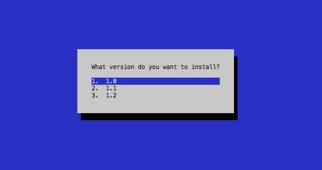

# NBashes

A simple tool for creation of interactive menus in the terminal for use in bash scripts, powered by `ncurses`.

## Usage
`nbashes <title> <options..>`

`<title>`: Title for above the options

`<options..>`: Choices the user can make, min 1, max 99

Output: The choice the user has made, as a zero-based number

## Example usage
`nbashes "What version do you want to install?" "1.0" "1.1" "1.2"`

Output: `0` for option 1 (`1.0`)
